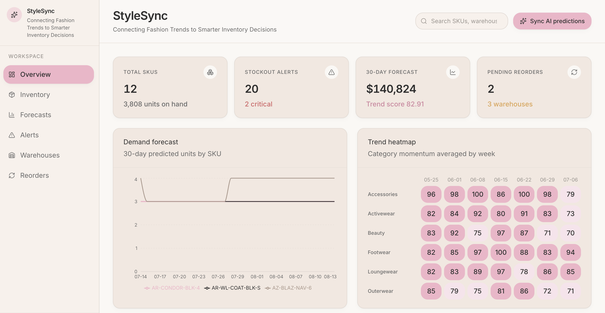
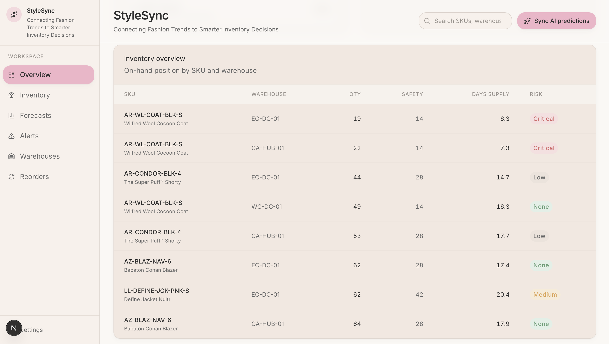
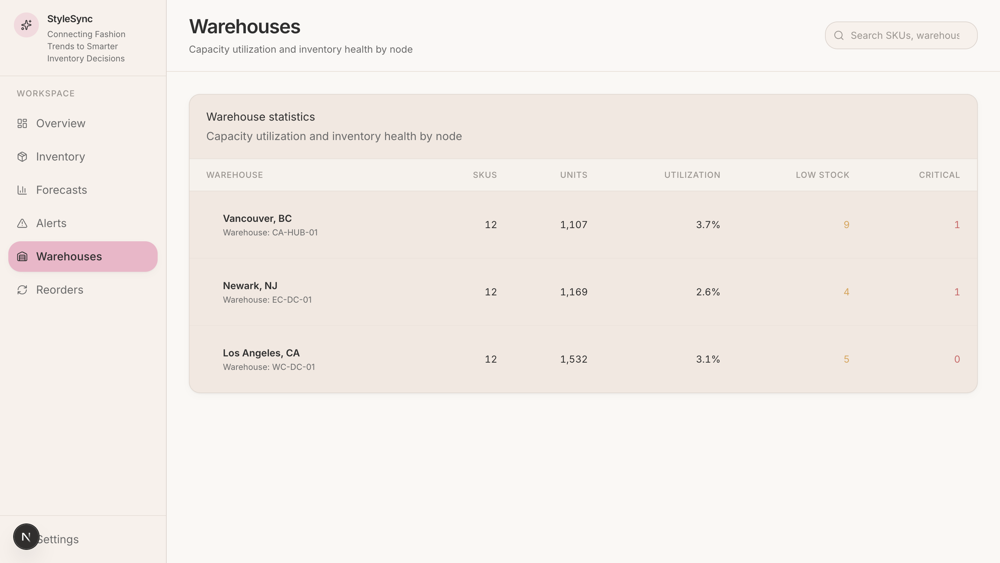
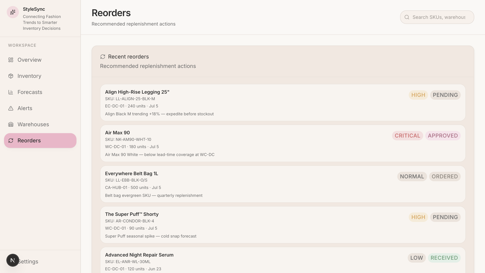
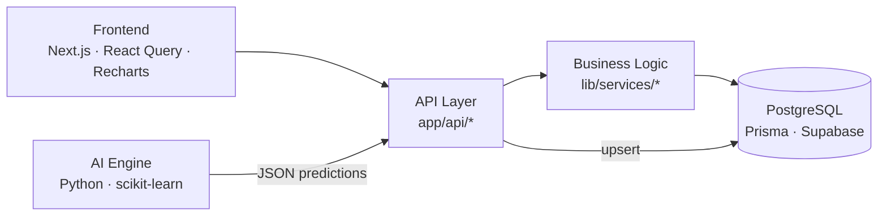

# StyleSync

**Connecting Fashion Trends to Smarter Inventory Decisions**

StyleSync is an enterprise-grade, AI-powered inventory forecasting platform for apparel and beauty retail. Built as a portfolio project that mirrors the tools used by merchandise planners and inventory analysts.

> Soft luxury UI · layered architecture · PostgreSQL · Python demand forecasting · Next.js App Router

---

### Dashboard overview



KPI cards, demand forecast, and trend heatmap for merchandising decisions.

### Inventory, Warehouses & Reorders Pages







SKU-level inventory position with stockout risk and reorder recommendations.

---

## Architecture



**Design rules enforced in code:**

- Frontend never talks to the database
- All reads/writes go through API routes
- Python AI lives in `ai-engine/` and syncs via `POST /api/predictions/sync`

---

## Features

| Module | What it does |
|--------|----------------|
| **Inventory overview** | On-hand qty, safety stock, days of supply, stockout risk |
| **Trend heatmap** | Category × week trend scores from fashion signals |
| **Demand forecast** | 30-day unit predictions with confidence |
| **Stockout alerts** | Lead-time + safety-stock risk scoring |
| **Reorder recommendations** | Priority-ranked replenishment actions |
| **Warehouse stats** | Utilization, low-stock, and critical counts by node |
| **AI sync** | Run Python pipeline and upsert predictions into Postgres |

---

## Tech Stack

| Layer | Technology |
|-------|------------|
| Frontend | Next.js 15 (App Router), React 19, TypeScript |
| Styling | Tailwind CSS v4, design tokens, Lucide icons |
| Client data | TanStack React Query, Recharts |
| Backend | Next.js API Routes |
| ORM / DB | Prisma 6, PostgreSQL (Supabase) |
| AI | Python, pandas, scikit-learn, BeautifulSoup |
| Deploy | Vercel (frontend), Supabase (database) |

---

## Project Structure

```
StyleSync/
├── app/                      # App Router pages + API routes
│   └── api/                  # inventory, trends, predictions, alerts, sync
├── components/
│   ├── layout/               # Sidebar, header
│   ├── dashboard/            # KPI, charts, tables, alerts
│   └── ui/                   # Button, Card, Badge, Stat
├── lib/
│   ├── services/             # Domain / business logic
│   ├── prisma.ts             # DB client singleton
│   └── ai/                   # Python pipeline runner
├── services/api-client.ts    # Typed frontend HTTP client
├── types/                    # Shared API contracts
├── prisma/                   # Schema, migrations, seed
├── ai-engine/                # Isolated Python forecasting pipeline
└── docs/                     # Screenshots + architecture diagram
```

---

## API

| Method | Endpoint | Description |
|--------|----------|-------------|
| `GET` | `/api/dashboard/summary` | KPI aggregates |
| `GET` | `/api/inventory` | Paginated inventory overview |
| `GET` | `/api/warehouses` | Warehouse statistics |
| `GET` | `/api/trends` | Trend heatmap cells |
| `GET` | `/api/predictions` | 30-day demand series |
| `GET` | `/api/alerts/stockouts` | Stockout risk alerts |
| `GET` | `/api/reorders` | Recent reorder recommendations |
| `POST` | `/api/predictions/sync` | Run AI engine and upsert forecasts |

---

## License

MIT — portfolio project by [Romy Nissan](https://github.com/romynissan).
