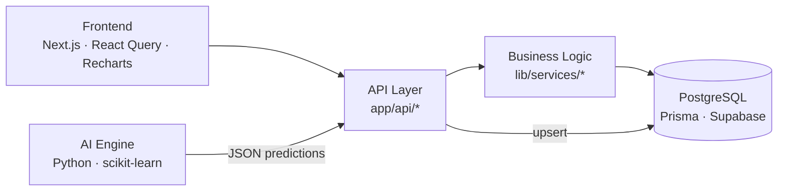

# StyleSync

**Connecting Fashion Trends to Smarter Inventory Decisions**

StyleSync is an enterprise-grade, AI-powered inventory forecasting platform for apparel and beauty retail. Built as a portfolio project that mirrors the tools used by merchandise planners and inventory analysts at companies like lululemon, Aritzia, Nike, and Estée Lauder.

> Soft luxury UI · layered architecture · PostgreSQL · Python demand forecasting · Next.js App Router

---

## Live Demo

> **Deployed demo:** *coming soon — deploy with the Vercel steps below.*  
> After you deploy, replace this line with your production URL.

**Local demo (2 minutes):**

```bash
git clone https://github.com/romynissan/StyleSync.git
cd StyleSync
npm install
cp .env.example .env   # add your PostgreSQL DATABASE_URL
npm run db:setup
npm run dev
```

Open [http://localhost:3000](http://localhost:3000).

---

## Screenshots

### Dashboard overview


KPI cards, demand forecast, and trend heatmap for merchandising decisions.

### Inventory & alerts


SKU-level inventory position with stockout risk and reorder recommendations.

---

## Architecture




**Design rules enforced in code:**

- Frontend never talks to the database
- All reads/writes go through API routes
- Python AI lives in `ai-engine/` and syncs via `POST /api/predictions/sync`

---

## Features

| Module | What it does |
|--------|----------------|
| **Inventory overview** | On-hand qty, safety stock, days of supply, stockout risk |
| **Trend heatmap** | Category × week trend scores from fashion signals |
| **Demand forecast** | 30-day unit predictions with confidence |
| **Stockout alerts** | Lead-time + safety-stock risk scoring |
| **Reorder recommendations** | Priority-ranked replenishment actions |
| **Warehouse stats** | Utilization, low-stock, and critical counts by node |
| **AI sync** | Run Python pipeline and upsert predictions into Postgres |

---

## Tech Stack

| Layer | Technology |
|-------|------------|
| Frontend | Next.js 15 (App Router), React 19, TypeScript |
| Styling | Tailwind CSS v4, design tokens, Lucide icons |
| Client data | TanStack React Query, Recharts |
| Backend | Next.js API Routes |
| ORM / DB | Prisma 6, PostgreSQL (Supabase) |
| AI | Python, pandas, scikit-learn, BeautifulSoup |
| Deploy | Vercel (frontend), Supabase (database) |

---

## Project Structure

```
StyleSync/
├── app/                      # App Router pages + API routes
│   └── api/                  # inventory, trends, predictions, alerts, sync
├── components/
│   ├── layout/               # Sidebar, header
│   ├── dashboard/            # KPI, charts, tables, alerts
│   └── ui/                   # Button, Card, Badge, Stat
├── lib/
│   ├── services/             # Domain / business logic
│   ├── prisma.ts             # DB client singleton
│   └── ai/                   # Python pipeline runner
├── services/api-client.ts    # Typed frontend HTTP client
├── types/                    # Shared API contracts
├── prisma/                   # Schema, migrations, seed
├── ai-engine/                # Isolated Python forecasting pipeline
└── docs/                     # Screenshots + architecture diagram
```

---

## Getting Started

### Prerequisites

- Node.js 20+
- PostgreSQL (Docker, Supabase, or Railway)
- Python 3.10+ (optional, for AI sync)

### 1. Install

```bash
npm install
```

### 2. Environment

```bash
cp .env.example .env
```

Set `DATABASE_URL` to your Postgres connection string.  
If the password contains `@`, encode it as `%40`.

### 3. Migrate & seed

```bash
npm run db:setup
```

Seeds 12 apparel/beauty SKUs, 3 warehouses, trend history, forecasts, and sample reorders.

### 4. Run

```bash
npm run dev
```

### 5. (Optional) AI pipeline

```bash
npm run ai:install
npm run ai:run
# or from the UI: Sync AI predictions
```

---

## API

| Method | Endpoint | Description |
|--------|----------|-------------|
| `GET` | `/api/dashboard/summary` | KPI aggregates |
| `GET` | `/api/inventory` | Paginated inventory overview |
| `GET` | `/api/warehouses` | Warehouse statistics |
| `GET` | `/api/trends` | Trend heatmap cells |
| `GET` | `/api/predictions` | 30-day demand series |
| `GET` | `/api/alerts/stockouts` | Stockout risk alerts |
| `GET` | `/api/reorders` | Recent reorder recommendations |
| `POST` | `/api/predictions/sync` | Run AI engine and upsert forecasts |

---

## Deploy to Vercel

1. Push this repo to GitHub (already on [`romynissan/StyleSync`](https://github.com/romynissan/StyleSync)).
2. Import the project in [Vercel](https://vercel.com/new).
3. Add environment variable: `DATABASE_URL` (Supabase connection string with `sslmode=require`).
4. Deploy. Build command: `prisma generate && next build` (already in `npm run build`).
5. Paste your Vercel URL into the **Live Demo** section above.

> Note: `POST /api/predictions/sync` requires Python on the host. On Vercel, use the seeded forecast data for the public demo, or run the AI pipeline locally / in a separate worker.

---

## Interview Talking Points

- **Layered architecture** — UI → API → services → Prisma → Postgres; easy to test and evolve
- **Stockout risk model** — safety stock × lead-time demand, not hard-coded flags
- **AI isolation** — Python ML stays out of the Next.js bundle; JSON contract + sync endpoint
- **Production hygiene** — typed DTO contracts, React Query caching, API `Cache-Control`, Prisma singleton
- **UX** — internal luxury-retail ops aesthetic (cream / taupe / blush accents), not e-commerce chrome

---

## License

MIT — portfolio project by [Romy Nissan](https://github.com/romynissan).
